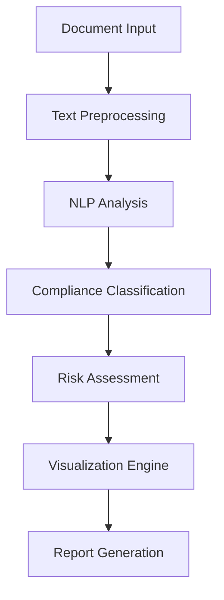

# 🔒 Security Policy and Compliance Automation Using NLP
> Transforming regulatory compliance through intelligent Natural Language Processing

[](https://gdpr.eu/)
[](https://www.hhs.gov/hipaa/index.html)
[](https://www.pcisecuritystandards.org/)
[](https://www.python.org/)
[](LICENSE)

## 📋 Overview

Our cutting-edge NLP-powered automation tool revolutionizes the way organizations handle compliance checking. By leveraging advanced Natural Language Processing techniques, this project automatically extracts, analyzes, and enforces security policies from regulatory documents, making compliance with GDPR, HIPAA, and PCI DSS frameworks both seamless and efficient.

The system uses state-of-the-art machine learning models to understand and process complex regulatory texts, providing real-time compliance assessment and actionable insights.

## 🎯 Key Objectives

- 📑 **Policy Extraction**: Develop sophisticated methods for automatically extracting relevant information from privacy policy texts using advanced NLP techniques
- 🤖 **GDPR Classification**: Implement and train state-of-the-art NLP models for accurate GDPR compliance classification
- 📊 **Model Evaluation**: Conduct comprehensive evaluation of various NLP models for identifying and interpreting regulatory principles
- 🔄 **Continuous Monitoring**: Establish automated systems for ongoing compliance monitoring and updates

## ⚡ Core Features

### 🧠 Advanced NLP Processing
Our system leverages cutting-edge natural language processing capabilities:
- **SentenceTransformers & PyTorch**: State-of-the-art language models for deep text understanding
- **NLTK Integration**: Advanced sentence tokenization for precise text analysis
- **spaCy Processing**: Comprehensive linguistic analysis and named entity recognition
- **Custom Classification Models**: Specially trained for regulatory compliance detection

### 🎨 Intuitive User Interface
Built with Streamlit for maximum usability:
- Clean, modern interface design
- Drag-and-drop document upload
- Real-time compliance feedback
- Customizable analysis parameters
- Interactive policy review system

### 📈 Interactive Visualizations
Powered by Plotly for comprehensive data representation:
- Dynamic compliance dashboards
- Risk assessment heat maps
- Temporal compliance tracking
- Policy coverage visualization
- Impact analysis graphs

### 📝 Comprehensive Reporting
Detailed analysis and actionable insights:
- GDPR compliance scoring
- Section-by-section analysis
- Policy gap identification
- Remediation recommendations
- Exportable compliance reports

## 🛠 Technical Architecture



## 🎥 Demo

Experience our solution in action through our comprehensive demo videos:

- [Setup and Configuration Demo](https://github.com/Susanta2102/NLP-GROUP-PROJECT/blob/main/Demo%20Video%20to%20run%20the%20script.mp4)
  - Complete installation walkthrough
  - System configuration guide
  - Basic usage tutorial

- [Feature Walkthrough](https://github.com/Susanta2102/NLP-GROUP-PROJECT/blob/main/Demo.mp4)
  - Advanced features demonstration
  - Real-world use cases
  - Best practices guide

## 🚀 Getting Started

### Prerequisites

Ensure you have the following installed:

```bash
Python 3.8+
PyTorch
spaCy
Transformers
NLTK
```

### Installation Steps

1. **Clone the Repository**
```bash
git clone https://github.com/Susanta2102/NLP-GROUP-PROJECT
cd NLP-GROUP-PROJECT
```

2. **Create Virtual Environment (Recommended)**
```bash
python -m venv venv
source venv/bin/activate  # On Windows: venv\Scripts\activate
```

3. **Install Dependencies**
```bash
pip install -r requirements.txt
```

4. **Download Required Models**
```bash
python -m spacy download en_core_web_sm
python -m nltk.downloader punkt
```

### Running the Application

#### Command Line Interface
For quick compliance checks:
```bash
python gdpr_compliance_checker.py sample.txt
```

#### Web Interface
For the full interactive experience:
```bash
streamlit run main.py
```

## 📸 Screenshots

### Compliance Report View
<div align="center">
  
  <p><em>Comprehensive compliance analysis dashboard showing key metrics and findings</em></p>
</div>

### Main Interface
<div align="center">
  
  <p><em>User-friendly interface for document upload and analysis configuration</em></p>
</div>

### Analysis Dashboard
<div align="center">
  
  <p><em>Interactive dashboard showing detailed compliance metrics and trends</em></p>
</div>

### Results Overview
<div align="center">
  
  <p><em>Detailed view of compliance results with actionable insights</em></p>
</div>

## 👥 Contributors

Our dedicated team of developers and researchers:

| Name | Email | Role | Responsibilities |
|------|--------|------|-----------------|
| SusantA Baidya | msa23009@iiitl.ac.in | Team Lead | Project coordination, Architecture design |
| Anjali Tamta | msa23026@iiitl.ac.in | NLP Engineer | Model development, Algorithm optimization |
| Sapna Kumari | msa23001@iiitl.ac.in | Backend Developer | API development, Database management |
| Akanksha Kumari | msa23003@iiitl.ac.in | UI/UX Designer | Interface design, User experience |
| Vikrant Kumad | msa23016@iiitl.ac.in | Data Scientist | Data analysis, Model training |

## 📚 Documentation

Comprehensive documentation is available in the `/docs` directory:
- [Installation Guide](docs/installation.md)
- [User Manual](docs/user-manual.md)
- [API Reference](docs/api-reference.md)
- [Contributing Guidelines](docs/contributing.md)

## 🔄 Updates and Versioning

We use [SemVer](http://semver.org/) for version control. For available versions, see the [tags on this repository](https://github.com/Susanta2102/NLP-GROUP-PROJECT/tags).

## 📄 License

This project is licensed under the MIT License - see the [LICENSE](LICENSE) file for details.

## 🤝 Contributing

We welcome contributions! Please read our [Contributing Guidelines](CONTRIBUTING.md) before submitting pull requests.

## 📮 Contact

For support or queries, please contact:
- Project Lead: SusantA Baidya (msa23009@iiitl.ac.in)
- Technical Support: support@nlpcomplianceproject.dev

## 🙏 Acknowledgments

- IIIT Lucknow for their support and resources
- The open-source NLP community
- All contributors and testers

---
<div align="center">
  <p>Made with ❤️ by the Security Policy Automation Team</p>
  <p>© 2024 NLP Compliance Project. All rights reserved.</p>
</div>
